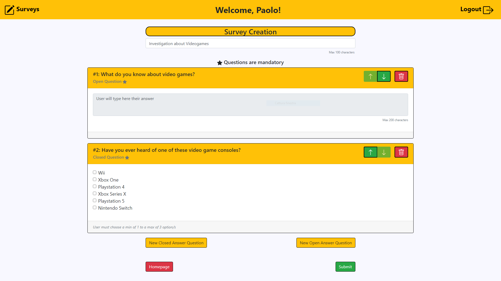

# Course: Web Applications I at Politecnico di Torino
# Exam: "Survey" (June 2021) 
## Student: BODNARESCUL PAOLO STEFANUT 

## React Client Application Routes

- Route `/`:
  - Non-authenticated user: List of **ALL** published surveys.
  - Authenticated user: List of **THEIR** published surveys.
- Route `/login`:
  - Non-authenticated user: Form where to insert **username** and **password** to log in.
  - Authenticated user: They get redirected to `/`.
- Route `create`:
  - Non-authenticated user: They get redirected to `/`.
  - Authenticated user: They have the possibility to **create** a new survey with open and/or closed questions as they wish.
- Route `view`: 
  - Non-authenticated user: They get redirected to `/`.
  - Authenticated user: They have the possibility to **view** the responses to one of their survey and navigate through users responses.
    - location.state: 
    ```
    { "surveyId": id, "title": "surveyTitle" }
    ``` 
- Route `answer`: 
  - Non-authenticated user: They have the possibility to **answer** the questions of the chosen survey.
    - location.state: 
    ```
    { "surveyId": id, "title": "surveyTitle" }
    ```  
  - Authenticated user: They get redirected to `/`.

## API Server
### Surveys, Questions, Responses management

### Retrieve Surveys
- HTTP Method: `GET` URL `/api/surveys`
- Description: Retrieve the list of surveys. If the user is authenticated it will only show their surveys. If the user is **not** authenticated it will show the full list of surveys.
- Request body: _None_
- Response: `200 OK` (success)
- Response body: Array of objects, each describing one survey. Authenticated user: 
```
[{ 
    "id": id, 
    "title": "surveyTitle",  
    "numAnswers": numAnswers
}]
```  
  Non-authenticated user: 
```
[{ 
    "id": id, 
    "title": "surveyTitle",  
    "adminName": "adminName"
}]
```  
- Error responses: `500 Internal Server Error` (generic error)

### Retrieve questions by surveyId
- HTTP Method: `GET` URL: `/api/surveys/:surveyId/questions`
- Description: Retrieve the questions of the survey with id `surveyId`. An authenticated user will need to see the questions when viewing the responses. A non-authenticated user will need to see the questions when answering the survey
- Request body: _None_
- Response: `200 OK` (success)
- Response body: Array of objects, each describing one question
```
[{ 
    "id": id, 
    "title": "questionTitle",  
    "position": position,
    "min": min,
    "max": max,
    "options": "options"
}]
``` 
- Error responses: `500 Internal Server Error` (generic error), `404 Not Found` (not present or unavailable. Probably generated because a survey with `surveyId` does not exist. A survey should always have _at least_ one question)

### Retrieve responses by surveyId
- HTTP Method: `GET` URL: `/api/surveys/:surveyId/responses`
- Description: Retrieve the questions to the survey with id `surveyId`. Only an authenticated user can use this API on their surveys
- Request body: _None_
- Reponse: `200 OK` (success)
- Response body: Array of objects, each describing a response:
```
[{ 
    "id": id, 
    "name": "name",  
    "position": position,
    "answers": "answers"
}]
``` 
### Add a new survey
- HTTP Method: `POST` URL: `/api/surveys`
- Description: Add a new survey to the surveys of the authenticated users (at client side at least one create question will be called after this API. A survey should always have _at least_ one question)
- Request body: description of the object to add (`adminId` propery is ignored and substituted with the id of the authenticated user, survey `id` value is not required and is ignored)
```
[{ 
    "title": "surveyTitle",
    "adminId": adminId
}]
``` 
- Response: `200 OK` (success)
- Response body: id of the object just inserted in the database (`this.lastID`)
- Error Response: `422 Unprocessable Entity` (values do not satisfy validators), `503 Service Unavailable` (database error)

### Add a new question
- HTTP Method: `POST` URL: `/api/surveys/:surveyId/questions`
- Description: Add a new question to the survey (with id `surveyId`) of the authenticated users
- Request body: description of the object to add (`surveyId` propery is ignored and substituted with the surveyId in the params, question `id` value is not required and is ignored)
```
[{ 
    "title": "questionTitle",
    "position": position,
    "min": min,
    "max": max,
    "options": "options",
    "surveyId": surveyId
}]
``` 
- Response: `200 OK` (success)
- Response body: id of the object just inserted in the database (`this.lastID`)
- Error Response: `422 Unprocessable Entity` (values do not satisfy validators), `503 Service Unavailable` (database error)

### Add a new response
- HTTP Method: `POST` URL: `/api/surveys/:surveyId/responses`
- Description: Add a new response to the survey with id `surveyId`
- Request body: description of the object to add (`surveyId` propery is ignored and substituted with the surveyId in the params, response `id` value is not required and is ignored)
```
[{ 
    "name": "name",
    "answers": "answers",
    "surveyId": surveyId
}]
``` 
- Response: `200 OK` (success)
- Response body: id of the object just inserted in the database (`this.lastID`)
- Error Response: `422 Unprocessable Entity` (values do not satisfy validators), `503 Service Unavailable` (database error)

### User management

### Log in
- HTTP Method: `POST` URL: `/api/sessions`
- Description: authenticate the user who is trying to log in
- Request body: credentials of the user who is trying to log in
```
{ 
    "username": "username",
    "password": "password"
}
``` 
- Reponse: `200 OK` (success)
- Response body: authenticated user
```
{ 
    "id": id,
    "username": "username",
    "name": "name"
}
``` 
- Error responses: `500 Internal Server Error` (generic error), `401 Unauthorized User` (login failed)

### Check if user is logged in
- HTTP Method: `GET` URL: `/api/sessions/current/`
- Description: check if current user is logged in and get their data
- Request body: _None_
- Response: `200 OK` (success)
- Response body: authenticated user
```
{ 
    "id": id,
    "username": "username",
    "name": "name"
}
``` 
  - Error responses: `500 Internal Server Error` (generic error), `401 Unauthorized User` (user is not logged in)

### Log out
- HTTP Method: `DELETE` URL: `/api/sessions/current/`
- Description: log out current user
- Request body: _None_
- Response: `200 OK` (success)
- Response body: _None_
- Error responses: `500 Internal Server Error` (generic error), `401 Unauthorized User` (user is not logged in)

## Database Tables
**PK** : Primary Key, **FK** : Foreign Key, **NN** : Not Nullable

- Table `administrators` - contains **PK** id `(int)` , email `(text NN)` , hash `(text NN)` , name `(text NN)`
    - Table to store the administrators
- Table `surveys` - contains **PK** id `(int)` , title `(text NN)` , **FK** adminId `(int NN)`
    - Table to store the surveys
- Table `questions` - contains **PK** id `(int)` , title `(text NN)` , position `(int NN)` , min `(int NN)` , max `(int)` , options `(JSON text)` , **FK** surveyId `(int NN)`
    - Table to store the questions. Options are in JSON format
        ```
        {
          "options":
                    [
                      { "id": 1, "text": "Yes"},
                      { "id": 2, "text": "No"}
                    ]
        }
        ```
- Table `responses` - contains **PK** id `(int)`, name `(text NN)` , answers `(JSON text NN)` , **FK** surveyId `(int NN)`
    - Table to store the respones. Answers are in JSON format
        ```
        {
          "answers":
                    [
                      { "id": 1, "value": [1, 2]},
                      { "id": 2, "value": "My answer to open question"}
                    ]
        }
        ```

## Main React Components

- `TopNavigationBar` (in `NavComponents.js`): This is the navigation bar always showing at the top of the site. It includes a button to go to homepage and a log in/log out button.
- `SurveyList` (in `ListSurveyComponents.js`): This component shows a list of surveys making use of `SurveyElement` components. If the user is logged in it only shows their surveys, otherwise it shows all the surveys. Additionally, it shows a create survey button if the user is authenticated.
- `SurveyElement` (in `ListSurveyComponents.js`): This component shows only one survey. If the user is authenticated a **View Results** button is present (only if num. of responses > 0), otherwise there will be a **Answer** button.
- `CreateSurvey` (in `CreateViewComponents.js`): This is the module to create a survey. There are buttons to add questions (which will open a modal), and buttons to go back to homepage or submit the survey. Each time a question is added it will appear thanks to the `questions.map`(which calls `Open Question` or `Closed Question`).
- `AddQuestionModal` (in `CreateViewComponents.js`): This contains the buttons that trigger the modal and the modal itself, which will change based on which button has been pressed (Open or Closed question). The modal calls in his body a `QuestionForm` module.
- `QuestionForm` (in `CreateViewComponents.js`): This component contains the form to insert the title of the questions and calls `ClosedFormInfo` or `OpenFormInfo` based on which question the user is creating.
- `OpenFormInfo` (in `CreateViewComponents.js`): This component contains the form to select if the question is Mandatory or Optional.
- `ClosedFormInfo` (in `CreateViewComponents.js`): This components contains the form for inserting new option, min and max. It also calls the component `OptionsForm` to edit or delete options.
- `ViewResponses` (in `CreateViewComponents.js`): This is the module to view responses to a survey. There are buttons to go forth and back between responses, and a button to go back to the homepage. Questions are shown thanks to the `questions.map` (which calls `Open Question` or `Closed Question`).
- `OpenQuestion` (in `CreateViewComponents.js`): This is the component to show an open question in read mode. This module is shared between `Create Survey` and `View Responses` hence it will show different things based on who calls it.
- `ClosedQuestion` (in `CreateViewComponents.js`): This is the component to show a closed question in read mode. It also exploits the component `DisplayOption` (in `CreateViewComponents.js`) to show the options of the question. This module is shared between `Create Survey` and `View Responses` hence it will show different things based on who calls it.
- `AnswerSurvey` (in `AnswerComponents.js`): This is the component that allows creating a response to a survey. It includes a go back to homepage and a submit button. To show the questions it exploits the components `OpenQuestion` and `ClosedQuestion` (in `AnswerComponents.js`).
- `OpenQuestion` (in `AnswerComponents.js`): This component makes possible to answer an open question. It includes a **Next** button to go to the next question.
- `ClosedQuestion` (in `AnswerComponents.js`): This component makes possible to answer a closed question. It exploits the component `DisplayOption`(in `AnswerComponents.js`). It includes a **Next** button to go to the next question.
- `FinalPage` (in `AnswerComponents.js`): This component will show some text to remind the user to insert their name and hit the submit button.
- `LoginModal` (in `LoginComponents.js`):
This component will do the validation. It exploits the `LoginForm` component to create the form where the user can insert their email and password. It also includes a Homepage and Login Button.
- `LoginForm` (in `LoginComponents.js`): This component creates the form where the user can isert their email and password. 
- `IconsErrorComponents.js` includes some icons/buttons (with their overlay) used across the other components and an `ErrorAlert` component.

## Screenshot



## Users Credentials

- paolo@polito.it , password
- anna@polito.it , password 
- alessio@polito.it , password 
